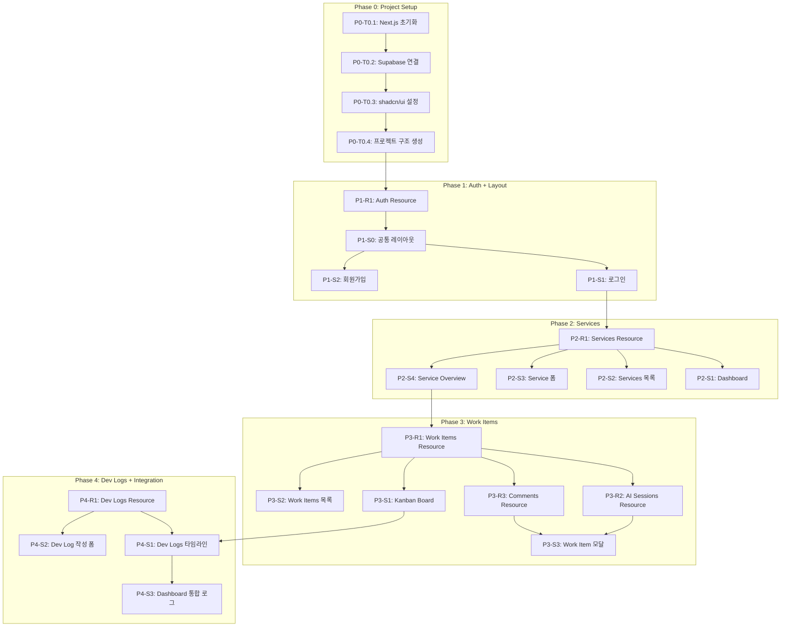

# TASKS.md - DevJourney

> Domain-Guarded 태스크 구조 (v2.0)
> "화면이 주도하되, 도메인이 방어한다"

---

## 의존성 구조

---

## Phase 0: Project Setup

> main 브랜치에서 작업 (Worktree 불필요)

### [ ] P0-T0.1: Next.js + TypeScript + Tailwind 초기화
- **담당**: frontend-specialist
- **스펙**: Next.js 14+ App Router, TypeScript strict mode, Tailwind CSS 3.x 프로젝트 생성
- **파일**: `package.json`, `tsconfig.json`, `tailwind.config.ts`, `next.config.js`
- **완료 조건**:
  - [ ] `npm run dev` 정상 실행
  - [ ] TypeScript strict mode 활성화
  - [ ] Tailwind CSS 동작 확인

### [ ] P0-T0.2: Supabase 프로젝트 연결
- **담당**: backend-specialist
- **스펙**: Supabase 클라이언트/서버 설정, 환경 변수 구성
- **파일**: `src/lib/supabase/client.ts`, `src/lib/supabase/server.ts`, `.env.local.example`
- **의존**: P0-T0.1
- **완료 조건**:
  - [ ] Supabase 브라우저 클라이언트 (`createBrowserClient`)
  - [ ] Supabase 서버 클라이언트 (`createServerClient`)
  - [ ] `.env.local.example`에 `NEXT_PUBLIC_SUPABASE_URL`, `NEXT_PUBLIC_SUPABASE_ANON_KEY`

### [ ] P0-T0.3: shadcn/ui + 디자인 토큰 설정
- **담당**: frontend-specialist
- **스펙**: shadcn/ui 설치, 05-design-system.md 기반 다크 모드 색상/타이포 설정
- **파일**: `components.json`, `src/app/globals.css`, `tailwind.config.ts`
- **의존**: P0-T0.1
- **완료 조건**:
  - [ ] shadcn/ui CLI 초기화
  - [ ] 다크 모드 기본 색상 (Slate 950 배경)
  - [ ] Inter + JetBrains Mono 폰트 설정
  - [ ] 기본 컴포넌트: Button, Input, Badge, Card, Dialog, Tabs, Select, Textarea

### [ ] P0-T0.4: 프로젝트 구조 생성
- **담당**: frontend-specialist
- **스펙**: TRD 기반 폴더 구조 생성
- **파일**: `src/app/`, `src/components/`, `src/lib/`
- **의존**: P0-T0.2, P0-T0.3
- **완료 조건**:
  - [ ] App Router 라우트 폴더 (`(auth)`, `(dashboard)`, `services/[id]/*`)
  - [ ] 컴포넌트 폴더 (`ui/`, `dashboard/`, `service/`, `work-item/`, `kanban/`, `dev-log/`, `layout/`)
  - [ ] lib 폴더 (`supabase/`, `hooks/`, `utils/`, `types/`)

---

## Phase 1: Auth + Common Layout

> Worktree: `worktree/phase-1-auth`

### P1-R1: Auth Resource

#### [ ] P1-R1-T1: Supabase Auth 미들웨어 구현
- **담당**: backend-specialist
- **리소스**: auth_users
- **스펙**: Supabase Auth 미들웨어, 세션 관리, 인증 가드
- **파일**: `tests/lib/auth.test.ts` → `src/middleware.ts`, `src/lib/supabase/middleware.ts`
- **Worktree**: `worktree/phase-1-auth`
- **TDD**: RED → GREEN → REFACTOR
- **완료 조건**:
  - [ ] 미인증 사용자 → `/login` 리다이렉트
  - [ ] 인증 사용자 → 보호된 페이지 접근 허용
  - [ ] 세션 토큰 자동 갱신

---

### P1-S0: 공통 레이아웃

#### [ ] P1-S0-T1: 사이드바 + 인증 레이아웃 구현
- **담당**: frontend-specialist
- **화면**: 공통 (`(dashboard)/layout.tsx`, `(auth)/layout.tsx`)
- **컴포넌트**: SidebarNavigation, AuthLayout, DashboardLayout
- **데이터 요구**: auth_users (세션 정보)
- **파일**: `tests/components/layout.test.tsx` → `src/components/layout/sidebar-navigation.tsx`, `src/app/(dashboard)/layout.tsx`, `src/app/(auth)/layout.tsx`
- **스펙**: 사이드바(240px, 축소 가능) Dashboard/Services 메뉴, 반응형 (모바일: 오버레이)
- **Worktree**: `worktree/phase-1-auth`
- **TDD**: RED → GREEN → REFACTOR
- **의존**: P1-R1-T1
- **완료 조건**:
  - [ ] 사이드바 네비게이션 (Dashboard, Services)
  - [ ] 데스크톱: 고정 240px, 태블릿: 접힘 가능, 모바일: 오버레이
  - [ ] 인증 레이아웃 (중앙 정렬 폼)

---

### P1-S1: 로그인 화면

#### [ ] P1-S1-T1: 로그인 UI 구현
- **담당**: frontend-specialist
- **화면**: /login
- **컴포넌트**: LoginForm
- **데이터 요구**: auth_users
- **파일**: `tests/pages/login.test.tsx` → `src/app/(auth)/login/page.tsx`
- **스펙**: 이메일/비밀번호 입력, React Hook Form + Zod 검증, Supabase signInWithPassword
- **Worktree**: `worktree/phase-1-auth`
- **TDD**: RED → GREEN → REFACTOR
- **의존**: P1-S0-T1
- **데모 상태**: normal, error, loading
- **완료 조건**:
  - [ ] 이메일/비밀번호 폼 + 유효성 검사
  - [ ] 로그인 성공 → `/` 이동
  - [ ] 로그인 실패 → 에러 메시지
  - [ ] `/signup` 링크

#### [ ] P1-S1-V: 로그인 연결점 검증
- **담당**: test-specialist
- **화면**: /login
- **검증 항목**:
  - [ ] Auth: Supabase signInWithPassword 동작
  - [ ] Navigation: 로그인 성공 → `/` 라우트 존재
  - [ ] Navigation: 회원가입 링크 → `/signup` 라우트 존재

---

### P1-S2: 회원가입 화면

#### [ ] P1-S2-T1: 회원가입 UI 구현
- **담당**: frontend-specialist
- **화면**: /signup
- **컴포넌트**: SignupForm
- **데이터 요구**: auth_users
- **파일**: `tests/pages/signup.test.tsx` → `src/app/(auth)/signup/page.tsx`
- **스펙**: 이메일/비밀번호/비밀번호확인, Supabase signUp, 이메일 인증 안내
- **Worktree**: `worktree/phase-1-auth`
- **TDD**: RED → GREEN → REFACTOR
- **의존**: P1-S0-T1
- **데모 상태**: normal, error, loading, success
- **병렬**: P1-S1-T1과 병렬 가능
- **완료 조건**:
  - [ ] 이메일/비밀번호/확인 폼 + 유효성 검사
  - [ ] 비밀번호 불일치 에러
  - [ ] 가입 성공 → 이메일 인증 안내 → `/login` 이동
  - [ ] `/login` 링크

#### [ ] P1-S2-V: 회원가입 연결점 검증
- **담당**: test-specialist
- **화면**: /signup
- **검증 항목**:
  - [ ] Auth: Supabase signUp 동작
  - [ ] Navigation: 가입 성공 → `/login` 이동
  - [ ] Navigation: 로그인 링크 → `/login` 라우트 존재

---

## Phase 2: Services

> Worktree: `worktree/phase-2-services`

### P2-R1: Services Resource

#### [ ] P2-R1-T1: Services DB 스키마 + RLS 구현
- **담당**: database-specialist
- **리소스**: services
- **스펙**: services 테이블 생성, RLS 정책, 인덱스, updated_at 트리거, last_activity_at 트리거
- **필드**: id, user_id, name, description, goal, target_users, current_stage, current_server, tech_stack, ai_role, status, progress, next_action, last_activity_at, created_at, updated_at
- **파일**: `supabase/migrations/001_create_services.sql`
- **Worktree**: `worktree/phase-2-services`
- **완료 조건**:
  - [ ] services 테이블 생성
  - [ ] RLS: `auth.uid() = user_id` (SELECT/INSERT/UPDATE/DELETE)
  - [ ] 인덱스: user_id, status
  - [ ] 트리거: update_updated_at
  - [ ] current_stage ENUM: idea/planning/design/development/testing/launch/enhancement
  - [ ] status ENUM: active/stalled/paused

#### [ ] P2-R1-T2: Services 쿼리 함수 구현
- **담당**: backend-specialist
- **리소스**: services
- **스펙**: Supabase 쿼리 함수 (CRUD + 목록)
- **파일**: `tests/lib/queries/services.test.ts` → `src/lib/supabase/queries/services.ts`
- **Worktree**: `worktree/phase-2-services`
- **TDD**: RED → GREEN → REFACTOR
- **의존**: P2-R1-T1
- **완료 조건**:
  - [ ] `getServices(userId)` - 전체 목록
  - [ ] `getServiceById(id)` - 상세 조회
  - [ ] `createService(data)` - 생성
  - [ ] `updateService(id, data)` - 수정
  - [ ] `deleteService(id)` - 삭제
  - [ ] TypeScript 타입 (`Service`, `CreateServiceInput`, `UpdateServiceInput`)

#### [ ] P2-R1-T3: Services TanStack Query 훅 구현
- **담당**: frontend-specialist
- **리소스**: services
- **스펙**: TanStack Query 훅 (useQuery, useMutation)
- **파일**: `tests/hooks/use-services.test.ts` → `src/lib/hooks/use-services.ts`
- **Worktree**: `worktree/phase-2-services`
- **TDD**: RED → GREEN → REFACTOR
- **의존**: P2-R1-T2
- **완료 조건**:
  - [ ] `useServices()` - queryKey: `['services']`
  - [ ] `useService(id)` - queryKey: `['services', id]`
  - [ ] `useCreateService()` - mutation + invalidate
  - [ ] `useUpdateService()` - mutation + invalidate
  - [ ] `useDeleteService()` - mutation + invalidate

---

### P2-S1: Dashboard 화면

#### [ ] P2-S1-T1: Dashboard UI 구현
- **담당**: frontend-specialist
- **화면**: /
- **컴포넌트**: SummaryCards (stat-card x4), MilestoneChart (chart), ServiceCardList (grid)
- **데이터 요구**: services (data_requirements 참조)
- **파일**: `tests/pages/dashboard.test.tsx` → `src/app/(dashboard)/page.tsx`, `src/components/dashboard/summary-cards.tsx`, `src/components/dashboard/milestone-chart.tsx`, `src/components/dashboard/service-card-list.tsx`
- **스펙**: 요약 카드(전체/진행중/정체/중단위험), 마일스톤 그래프(Recharts), 서비스 카드 목록
- **Worktree**: `worktree/phase-2-services`
- **TDD**: RED → GREEN → REFACTOR
- **의존**: P2-R1-T3
- **데모 상태**: loading, empty, normal, stalled-warning
- **완료 조건**:
  - [ ] 4개 요약 카드 (전체 수, 진행중, 정체, 중단 위험)
  - [ ] 마일스톤 진행률 그래프 (Recharts bar/area)
  - [ ] 서비스 카드 목록 (이름, 상태색상, 진행률%, 단계, 마지막활동일, 다음액션)
  - [ ] 정체 경고: 7일 이상 활동 없음 → 노란색
  - [ ] 서비스 카드 클릭 → `/services/[id]` 이동

#### [ ] P2-S1-V: Dashboard 연결점 검증
- **담당**: test-specialist
- **화면**: /
- **검증 항목**:
  - [ ] Field Coverage: services.[id,name,status,progress,current_stage,last_activity_at,next_action] 존재
  - [ ] Navigation: ServiceCard → /services/:id 라우트 존재
  - [ ] Auth: 미인증 시 /login 리다이렉트

---

### P2-S2: Services 목록 화면

#### [ ] P2-S2-T1: Services 목록 UI 구현
- **담당**: frontend-specialist
- **화면**: /services
- **컴포넌트**: ServicesHeader, ServicesSearch, ServicesTable
- **데이터 요구**: services (data_requirements 참조)
- **파일**: `tests/pages/services-list.test.tsx` → `src/app/(dashboard)/services/page.tsx`, `src/components/service/services-table.tsx`
- **스펙**: 서비스 테이블/카드, 검색/필터, "새 서비스" 버튼
- **Worktree**: `worktree/phase-2-services`
- **TDD**: RED → GREEN → REFACTOR
- **의존**: P2-R1-T3
- **병렬**: P2-S1-T1과 병렬 가능
- **데모 상태**: loading, empty, normal
- **완료 조건**:
  - [ ] 서비스 테이블 (이름, 상태, 단계, 진행률, 마지막활동)
  - [ ] 검색 기능 (서비스명)
  - [ ] "새 서비스" 버튼 → `/services/new`
  - [ ] 행 클릭 → `/services/[id]`

#### [ ] P2-S2-V: Services 목록 연결점 검증
- **담당**: test-specialist
- **화면**: /services
- **검증 항목**:
  - [ ] Field Coverage: services.[id,name,description,status,current_stage,progress,last_activity_at] 존재
  - [ ] Navigation: 서비스 행 → /services/:id 라우트 존재
  - [ ] Navigation: "새 서비스" → /services/new 라우트 존재

---

### P2-S3: Service 등록/편집 폼

#### [ ] P2-S3-T1: Service 폼 UI 구현
- **담당**: frontend-specialist
- **화면**: /services/new, /services/[id]/edit
- **컴포넌트**: ServiceForm (8개 필드)
- **데이터 요구**: services (data_requirements 참조)
- **파일**: `tests/pages/service-form.test.tsx` → `src/app/(dashboard)/services/new/page.tsx`, `src/app/(dashboard)/services/[id]/edit/page.tsx`, `src/components/service/service-form.tsx`
- **스펙**: React Hook Form + Zod, 8개 필드, 기술 스택 태그 입력
- **Worktree**: `worktree/phase-2-services`
- **TDD**: RED → GREEN → REFACTOR
- **의존**: P2-R1-T3
- **병렬**: P2-S2-T1과 병렬 가능
- **데모 상태**: create, edit, loading, error
- **완료 조건**:
  - [ ] 8개 필드 폼 (서비스명 필수)
  - [ ] 기술 스택 태그 입력
  - [ ] 현재 단계 select (7개 옵션)
  - [ ] 생성 모드: 빈 폼 → 저장 → `/services` 이동
  - [ ] 편집 모드: 기존 데이터 프리필 → 저장

#### [ ] P2-S3-V: Service 폼 연결점 검증
- **담당**: test-specialist
- **화면**: /services/new, /services/[id]/edit
- **검증 항목**:
  - [ ] Field Coverage: services.[name,description,goal,target_users,current_stage,current_server,tech_stack,ai_role] 존재
  - [ ] Navigation: 저장 성공 → /services 이동
  - [ ] Navigation: 취소 → 이전 화면 이동

---

### P2-S4: Service Overview 화면

#### [ ] P2-S4-T1: Service Overview UI 구현
- **담당**: frontend-specialist
- **화면**: /services/[id]
- **컴포넌트**: ServiceHeader, DetailMilestoneChart, ServiceInfo, RecentDecisions, ServiceTabs
- **데이터 요구**: services, work_items (data_requirements 참조)
- **파일**: `tests/pages/service-overview.test.tsx` → `src/app/(dashboard)/services/[id]/page.tsx`, `src/components/service/service-header.tsx`, `src/components/service/service-tabs.tsx`
- **스펙**: 서비스 헤더(이름+상태뱃지+편집), 상세 그래프, 정보 요약, 최근 의사결정, 4탭 네비게이션
- **Worktree**: `worktree/phase-2-services`
- **TDD**: RED → GREEN → REFACTOR
- **의존**: P2-R1-T3
- **데모 상태**: loading, normal, no-decisions
- **완료 조건**:
  - [ ] 서비스 헤더 (이름, 상태 뱃지, 편집 버튼)
  - [ ] 상세 마일스톤 그래프 + 진행률
  - [ ] 서비스 정보 요약 (목적, 단계, 핵심 목표)
  - [ ] 최근 의사결정 목록 (Work Item의 decision 필드)
  - [ ] 4탭 네비게이션 (Overview/Board/Work Items/Dev Logs)

#### [ ] P2-S4-V: Service Overview 연결점 검증
- **담당**: test-specialist
- **화면**: /services/[id]
- **검증 항목**:
  - [ ] Field Coverage: services.[id,name,status,description,goal,current_stage,progress,next_action,tech_stack] 존재
  - [ ] Field Coverage: work_items.[id,title,decision_reason,status,updated_at] 존재
  - [ ] Navigation: 편집 버튼 → /services/:id/edit 라우트 존재
  - [ ] Navigation: Board 탭 → /services/:id/board 라우트 존재
  - [ ] Navigation: Work Items 탭 → /services/:id/work-items 라우트 존재
  - [ ] Navigation: Dev Logs 탭 → /services/:id/dev-logs 라우트 존재

---

## Phase 3: Work Items

> Worktree: `worktree/phase-3-work-items`

### P3-R1: Work Items Resource

#### [ ] P3-R1-T1: Work Items DB 스키마 + RLS 구현
- **담당**: database-specialist
- **리소스**: work_items
- **스펙**: work_items 테이블, RLS, 인덱스, service last_activity_at 트리거
- **필드**: id, service_id, user_id, title, description, type, priority, status, assignee_id, problem, options, decision_reason, result, position, created_at, updated_at
- **파일**: `supabase/migrations/002_create_work_items.sql`
- **Worktree**: `worktree/phase-3-work-items`
- **완료 조건**:
  - [ ] work_items 테이블 생성
  - [ ] RLS: `auth.uid() = user_id`
  - [ ] 인덱스: service_id, status, (service_id, status)
  - [ ] 트리거: update_updated_at, update_service_activity
  - [ ] type ENUM: feature/bug/refactor/infra/ai-prompt
  - [ ] status ENUM: backlog/ready/in-progress/review/done

#### [ ] P3-R1-T2: Work Items 쿼리 함수 구현
- **담당**: backend-specialist
- **리소스**: work_items
- **스펙**: Supabase 쿼리 함수 (CRUD + 상태별 조회 + 위치 업데이트)
- **파일**: `tests/lib/queries/work-items.test.ts` → `src/lib/supabase/queries/work-items.ts`
- **Worktree**: `worktree/phase-3-work-items`
- **TDD**: RED → GREEN → REFACTOR
- **의존**: P3-R1-T1
- **완료 조건**:
  - [ ] `getWorkItems(serviceId)` - 서비스별 전체
  - [ ] `getWorkItemsByStatus(serviceId, status)` - 상태별
  - [ ] `getWorkItemById(id)` - 상세
  - [ ] `createWorkItem(data)` - 생성
  - [ ] `updateWorkItem(id, data)` - 수정
  - [ ] `updateWorkItemPosition(id, status, position)` - Kanban 이동
  - [ ] `deleteWorkItem(id)` - 삭제
  - [ ] TypeScript 타입 (`WorkItem`, `CreateWorkItemInput`)

#### [ ] P3-R1-T3: Work Items TanStack Query 훅 구현
- **담당**: frontend-specialist
- **리소스**: work_items
- **스펙**: TanStack Query 훅 + Kanban 낙관적 업데이트
- **파일**: `tests/hooks/use-work-items.test.ts` → `src/lib/hooks/use-work-items.ts`
- **Worktree**: `worktree/phase-3-work-items`
- **TDD**: RED → GREEN → REFACTOR
- **의존**: P3-R1-T2
- **완료 조건**:
  - [ ] `useWorkItems(serviceId)` - queryKey: `['work-items', serviceId]`
  - [ ] `useWorkItem(id)` - queryKey: `['work-items', 'detail', id]`
  - [ ] `useCreateWorkItem()` - mutation + invalidate
  - [ ] `useUpdateWorkItem()` - mutation + 낙관적 업데이트
  - [ ] `useMoveWorkItem()` - Kanban 드래그용 낙관적 업데이트

---

### P3-R2: AI Sessions Resource

#### [ ] P3-R2-T1: AI Sessions DB 스키마 + 쿼리 구현
- **담당**: database-specialist
- **리소스**: ai_sessions
- **스펙**: ai_sessions 테이블, RLS, 쿼리 함수
- **필드**: id, work_item_id, user_id, url, summary, ai_provider, created_at
- **파일**: `supabase/migrations/003_create_ai_sessions.sql`, `tests/lib/queries/ai-sessions.test.ts` → `src/lib/supabase/queries/ai-sessions.ts`
- **Worktree**: `worktree/phase-3-work-items`
- **TDD**: RED → GREEN → REFACTOR
- **병렬**: P3-R1-T1과 병렬 가능 (테이블 독립)
- **완료 조건**:
  - [ ] ai_sessions 테이블 + RLS + 인덱스
  - [ ] `getAISessions(workItemId)` - queryKey: `['ai-sessions', workItemId]`
  - [ ] `createAISession(data)` - 세션 추가
  - [ ] `deleteAISession(id)` - 삭제
  - [ ] ai_provider ENUM: chatgpt/gemini/claude/other

---

### P3-R3: Work Item Comments Resource

#### [ ] P3-R3-T1: Comments DB 스키마 + 쿼리 구현
- **담당**: database-specialist
- **리소스**: work_item_comments
- **스펙**: work_item_comments 테이블, RLS, 쿼리 함수 (커멘트 + 상태변경 로그)
- **필드**: id, work_item_id, user_id, content, type, metadata, created_at
- **파일**: `supabase/migrations/004_create_comments.sql`, `tests/lib/queries/comments.test.ts` → `src/lib/supabase/queries/comments.ts`
- **Worktree**: `worktree/phase-3-work-items`
- **TDD**: RED → GREEN → REFACTOR
- **병렬**: P3-R1-T1과 병렬 가능
- **완료 조건**:
  - [ ] work_item_comments 테이블 + RLS + 인덱스
  - [ ] `getComments(workItemId)` - 커멘트 + 로그 조회
  - [ ] `createComment(data)` - 커멘트 작성
  - [ ] `createStatusChangeLog(workItemId, from, to)` - 상태 변경 자동 기록
  - [ ] type ENUM: comment/status_change/system

---

### P3-S1: Kanban Board 화면

#### [ ] P3-S1-T1: Kanban Board UI 구현
- **담당**: frontend-specialist
- **화면**: /services/[id]/board
- **컴포넌트**: KanbanBoard, KanbanColumn, WorkItemCard, QuickCreateModal
- **데이터 요구**: work_items (data_requirements 참조)
- **파일**: `tests/pages/kanban-board.test.tsx` → `src/app/(dashboard)/services/[id]/board/page.tsx`, `src/components/kanban/kanban-board.tsx`, `src/components/kanban/kanban-column.tsx`, `src/components/kanban/work-item-card.tsx`
- **스펙**: 5컬럼 Kanban, @dnd-kit 드래그앤드롭, 빠른 생성, 카드 클릭 → 모달
- **Worktree**: `worktree/phase-3-work-items`
- **TDD**: RED → GREEN → REFACTOR
- **의존**: P3-R1-T3
- **데모 상태**: loading, empty, normal, dragging
- **완료 조건**:
  - [ ] 5개 컬럼 (Backlog/Ready/In Progress/Review/Done)
  - [ ] 각 컬럼: 상태 색상 도트 + 이름 + 카운트 + "+" 버튼
  - [ ] 카드: 제목 + 유형뱃지 + 우선순위 색상
  - [ ] @dnd-kit 드래그앤드롭 → status + position 업데이트
  - [ ] "+" 빠른 생성 → 제목 + 유형 입력 모달
  - [ ] 카드 클릭 → Work Item 모달 열기

#### [ ] P3-S1-V: Kanban Board 연결점 검증
- **담당**: test-specialist
- **화면**: /services/[id]/board
- **검증 항목**:
  - [ ] Field Coverage: work_items.[id,title,type,priority,status,assignee_id,position] 존재
  - [ ] Navigation: 카드 클릭 → Work Item 모달 열기
  - [ ] 드래그앤드롭 → work_item status 업데이트 동작
  - [ ] 빠른 생성 → work_item 생성 동작

---

### P3-S2: Work Items 목록 화면

#### [ ] P3-S2-T1: Work Items 목록 UI 구현
- **담당**: frontend-specialist
- **화면**: /services/[id]/work-items
- **컴포넌트**: WorkItemsHeader, WorkItemsFilter, WorkItemsTable
- **데이터 요구**: work_items (data_requirements 참조)
- **파일**: `tests/pages/work-items-list.test.tsx` → `src/app/(dashboard)/services/[id]/work-items/page.tsx`, `src/components/work-item/work-items-table.tsx`, `src/components/work-item/work-items-filter.tsx`
- **스펙**: 테이블 목록 + 상태/유형/우선순위 필터 + 정렬
- **Worktree**: `worktree/phase-3-work-items`
- **TDD**: RED → GREEN → REFACTOR
- **의존**: P3-R1-T3
- **병렬**: P3-S1-T1과 병렬 가능
- **데모 상태**: loading, empty, normal, filtered
- **완료 조건**:
  - [ ] Work Item 테이블 (제목, 유형, 우선순위, 상태, 생성일)
  - [ ] 필터: 상태, 유형, 우선순위
  - [ ] 정렬: 생성일, 우선순위
  - [ ] "새 Work Item" 버튼 → 모달
  - [ ] 행 클릭 → Work Item 모달

#### [ ] P3-S2-V: Work Items 목록 연결점 검증
- **담당**: test-specialist
- **화면**: /services/[id]/work-items
- **검증 항목**:
  - [ ] Field Coverage: work_items.[id,title,type,priority,status,created_at] 존재
  - [ ] Navigation: 행 클릭 → Work Item 모달

---

### P3-S3: Work Item 모달

#### [ ] P3-S3-T1: Work Item 모달 UI 구현
- **담당**: frontend-specialist
- **화면**: 오버레이 (모달)
- **컴포넌트**: WorkItemModal, TabBasicInfo, TabDecision, TabAISessions, TabActivityLog
- **데이터 요구**: work_items, ai_sessions, work_item_comments (data_requirements 참조)
- **파일**: `tests/components/work-item-modal.test.tsx` → `src/components/work-item/work-item-modal.tsx`, `src/components/work-item/tab-basic-info.tsx`, `src/components/work-item/tab-decision.tsx`, `src/components/work-item/tab-ai-sessions.tsx`, `src/components/work-item/tab-activity-log.tsx`
- **스펙**: 640px 모달, 4탭 (기본정보/의사결정/AI세션/활동로그), 자동 저장
- **Worktree**: `worktree/phase-3-work-items`
- **TDD**: RED → GREEN → REFACTOR
- **의존**: P3-R1-T3, P3-R2-T1, P3-R3-T1
- **데모 상태**: loading, create, edit, with-sessions, with-comments
- **완료 조건**:
  - [ ] 탭1 기본정보: 제목, 설명, 유형(select), 우선순위(select), 상태(select)
  - [ ] 탭2 의사결정: Problem, 고려한 선택지, 최종 결정 이유, 결과 (textarea)
  - [ ] 탭3 AI세션: 세션 목록 (URL+요약+제공자), "세션 추가" 폼
  - [ ] 탭4 활동로그: 상태 변경 이력 + 커멘트 목록 + 입력
  - [ ] 상태 변경 시 활동 로그 자동 기록
  - [ ] 필드 변경 자동 저장 (debounce)

#### [ ] P3-S3-V: Work Item 모달 연결점 검증
- **담당**: test-specialist
- **화면**: Work Item 모달
- **검증 항목**:
  - [ ] Field Coverage: work_items.[id,title,description,type,priority,status,problem,options,decision_reason,result] 존재
  - [ ] Field Coverage: ai_sessions.[id,url,summary,ai_provider,created_at] 존재
  - [ ] Field Coverage: work_item_comments.[id,content,type,metadata,created_at] 존재
  - [ ] 상태 변경 → work_item_comments에 status_change 기록

---

## Phase 4: Dev Logs + Integration

> Worktree: `worktree/phase-4-dev-logs`

### P4-R1: Dev Logs Resource

#### [ ] P4-R1-T1: Dev Logs DB 스키마 + 쿼리 구현
- **담당**: database-specialist
- **리소스**: dev_logs
- **스펙**: dev_logs 테이블, RLS, UNIQUE(service_id, log_date), 쿼리 함수, service last_activity_at 트리거
- **필드**: id, service_id, user_id, done, decided, deferred, next_action, log_date, created_at, updated_at
- **파일**: `supabase/migrations/005_create_dev_logs.sql`, `tests/lib/queries/dev-logs.test.ts` → `src/lib/supabase/queries/dev-logs.ts`
- **Worktree**: `worktree/phase-4-dev-logs`
- **TDD**: RED → GREEN → REFACTOR
- **완료 조건**:
  - [ ] dev_logs 테이블 + RLS + 인덱스
  - [ ] UNIQUE 제약: (service_id, log_date)
  - [ ] 트리거: update_updated_at, update_service_activity
  - [ ] `getDevLogs(serviceId)` - 서비스별 (최신순)
  - [ ] `getAllDevLogs(userId, limit)` - 통합 로그 (최신순)
  - [ ] `getDevLogByDate(serviceId, date)` - 날짜별 조회
  - [ ] `createDevLog(data)` - 생성
  - [ ] `updateDevLog(id, data)` - 수정
  - [ ] TanStack Query 훅: `useDevLogs`, `useAllDevLogs`, `useCreateDevLog`

---

### P4-S1: Dev Logs 타임라인 화면

#### [ ] P4-S1-T1: Dev Logs 타임라인 UI 구현
- **담당**: frontend-specialist
- **화면**: /services/[id]/dev-logs
- **컴포넌트**: DevLogsHeader, DevLogsTimeline, DevLogCard
- **데이터 요구**: dev_logs (data_requirements 참조)
- **파일**: `tests/pages/dev-logs.test.tsx` → `src/app/(dashboard)/services/[id]/dev-logs/page.tsx`, `src/components/dev-log/dev-logs-timeline.tsx`, `src/components/dev-log/dev-log-card.tsx`
- **스펙**: 타임라인 목록 (최신순, 날짜별 그룹), 아코디언 확장, "새 로그 작성" 버튼
- **Worktree**: `worktree/phase-4-dev-logs`
- **TDD**: RED → GREEN → REFACTOR
- **의존**: P4-R1-T1
- **데모 상태**: loading, empty, normal, expanded
- **완료 조건**:
  - [ ] 타임라인 목록 (최신순)
  - [ ] 각 카드: 날짜, "오늘 한 것" 미리보기, "다음 액션" 미리보기
  - [ ] 클릭 시 아코디언 확장 (4개 필드 전체)
  - [ ] "새 로그 작성" 버튼

#### [ ] P4-S1-V: Dev Logs 연결점 검증
- **담당**: test-specialist
- **화면**: /services/[id]/dev-logs
- **검증 항목**:
  - [ ] Field Coverage: dev_logs.[id,done,decided,deferred,next_action,log_date,created_at] 존재
  - [ ] Navigation: "새 로그 작성" → Dev Log 작성 폼 열기

---

### P4-S2: Dev Log 작성 폼

#### [ ] P4-S2-T1: Dev Log 작성 폼 UI 구현
- **담당**: frontend-specialist
- **화면**: 오버레이 (모달 또는 인라인)
- **컴포넌트**: DevLogForm
- **데이터 요구**: dev_logs, services (data_requirements 참조)
- **파일**: `tests/components/dev-log-form.test.tsx` → `src/components/dev-log/dev-log-form.tsx`
- **스펙**: 날짜(기본 오늘) + 4개 textarea (오늘 한 것/확정한 것/보류한 것/다음에 할 것), 최소 1개 입력 검증
- **Worktree**: `worktree/phase-4-dev-logs`
- **TDD**: RED → GREEN → REFACTOR
- **의존**: P4-R1-T1
- **병렬**: P4-S1-T1과 병렬 가능
- **데모 상태**: create, edit, error
- **완료 조건**:
  - [ ] 날짜 필드 (기본값: 오늘)
  - [ ] 4개 textarea (템플릿 프리필 가능)
  - [ ] 최소 1개 필드 입력 유효성 검사
  - [ ] 같은 날짜 중복 방지 (기존 로그 있으면 편집 모드)
  - [ ] 저장 → 타임라인에 추가

#### [ ] P4-S2-V: Dev Log 폼 연결점 검증
- **담당**: test-specialist
- **화면**: Dev Log 작성 폼
- **검증 항목**:
  - [ ] Field Coverage: dev_logs.[done,decided,deferred,next_action,log_date] 존재
  - [ ] UNIQUE 제약: 같은 서비스+날짜 중복 생성 시 에러 처리

---

### P4-S3: Dashboard 통합 로그 탭

#### [ ] P4-S3-T1: Dashboard 통합 Dev Log 탭 구현
- **담당**: frontend-specialist
- **화면**: / (Dashboard 내 탭)
- **컴포넌트**: IntegratedLogTab
- **데이터 요구**: dev_logs (scope: all)
- **파일**: `tests/components/integrated-log-tab.test.tsx` → `src/components/dashboard/integrated-log-tab.tsx`
- **스펙**: 모든 서비스의 최근 Dev Log 타임라인 (서비스명 표시), 탭 전환
- **Worktree**: `worktree/phase-4-dev-logs`
- **TDD**: RED → GREEN → REFACTOR
- **의존**: P4-R1-T1, P2-S1-T1
- **완료 조건**:
  - [ ] 서비스 카드 목록 / 통합 로그 탭 전환
  - [ ] 통합 로그: 모든 서비스 최근 Dev Log 타임라인
  - [ ] 각 로그에 서비스명 표시
  - [ ] 로그 클릭 → 해당 서비스 Dev Logs 페이지 이동

#### [ ] P4-S3-V: Dashboard 통합 로그 연결점 검증
- **담당**: test-specialist
- **화면**: / (통합 로그 탭)
- **검증 항목**:
  - [ ] Field Coverage: dev_logs.[id,service_id,done,next_action,log_date] 존재
  - [ ] Navigation: 로그 클릭 → /services/:id/dev-logs 라우트 존재

---

## Phase 요약

| Phase | Resource 태스크 | Screen 태스크 | Verification | 총 |
|-------|----------------|--------------|-------------|-----|
| P0 | - | 4 (setup) | - | 4 |
| P1 | 1 (Auth) | 3 (Layout+Login+Signup) | 2 | 6 |
| P2 | 3 (Services DB+Query+Hook) | 4 (Dashboard+List+Form+Overview) | 4 | 11 |
| P3 | 5 (WorkItems+AI+Comments) | 3 (Board+List+Modal) | 3 | 11 |
| P4 | 1 (DevLogs DB+Query) | 3 (Timeline+Form+Integration) | 3 | 7 |
| **합계** | **10** | **17** | **12** | **39** |

---

## 병렬 실행 요약

| Phase | 병렬 가능 그룹 |
|-------|--------------|
| P0 | T0.1 → T0.2 + T0.3(병렬) → T0.4 |
| P1 | S1-T1 + S2-T1 (병렬) |
| P2 | S1-T1 + S2-T1 + S3-T1 (병렬, R1-T3 완료 후) |
| P3 | R2-T1 + R3-T1 (병렬), S1-T1 + S2-T1 (병렬) |
| P4 | S1-T1 + S2-T1 (병렬) |
